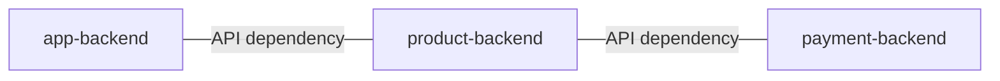

# Day-21 ArgoCD 介紹 - 進階功能

# 前言
今天會來介紹兩個 ArgoCD 的進階功能
1. Sync Waves
2. Sync Windows
3. Alert & Notification

# Sync Waves
大部分的時候，我們的系統都是由多個服務組成的，而服務之間時常有依賴關係 (如 API 依賴)，所以我們會希望能控制每個服務的部署順序，來保證 API 的邏輯都符合預期。
### 假設服務依賴性如下

我們希望的部署順序通常會是
1. 先部署 payment-backend 
1. 等 payment-backend 部署完成後，再 production-backend
1. 最後部署 app-backend   

這樣只要遵守 **每個服務都 API 都向前兼容一個版本** 的開發原則，就能保證服務不會中斷或出錯，不需要發佈維護或停機措施。

透過 ArgoCD **Sync Waves** 的功能，使用 `argocd.argoproj.io/sync-wave` 的 annotation 來指定部署順序
```yaml
metadata:
  annotations:
    argocd.argoproj.io/sync-wave: "5"
```
所有 ArgoCD Application 管理的 resource 的 `argocd.argoproj.io/sync-wave` 預設值為 0，當 ArgoCD 部署時，會依據 `sync-wave` 的值，獨立進行有順序性與依賴性的部署。
- 依據 `sync-wave` 值，由小至大的依序進行部署
- 當上一個 `sync-wave` 都部署成功時，才會進行下一個 `sync-wave` 部署。

所以要滿足我們的部署順序需求時，只要於該 Resource 的 YAML 中加上 annotation 即可，例如
```yaml
# payment-backend
apiVersion: apps/v1
kind: Deployment
metadata:
  name: payment-backend
  annotations:
    argocd.argoproj.io/sync-wave: "-10"

# product-backend
apiVersion: apps/v1
kind: Deployment
metadata:
  name: product-backend
  annotations:
    argocd.argoproj.io/sync-wave: "-5"

# app-backend
apiVersion: apps/v1
kind: Deployment
metadata:
  name: app-backend
  annotations:
    argocd.argoproj.io/sync-wave: "0" # 同 sync-wave 預設值 0
```
當 ArgoCD 開始同步時，會遵循配置有以下行為
1. 先部署 `payment-backend`，因為 `sync-wave` 小於其他 Resournce
2. 當 `payment-backend` 部署成功時，觸發 `product-backend` 的部署
3. 最後當 `product-backend` 部署成功時，才觸發 `app-backend` 部署

透過 **Sync Waves** 讓我們能靈活的且安全的使用 ArgoCD，確保相依的資源已正確部署，避免在依賴未準備好時就啟動應用，從而減少應用失敗的風險。

> 範例 YAML 能參閱[GitHub](https://github.com/YihongGao/iThome_30Day_2024/tree/main/resources/day21/argoCD-demo)

## Sync Windows
**Sync Windows** 是一種用來控制何時允許或禁止資源同步的功能，適合用於在特定時間範圍內進行自動化資源同步或阻止同步操作。當你希望在業務高峰期避免更新，或為了合規需求，僅允許在特定時段內進行應用部署時。

**Sync Windows** 是配置再 ArgoCD AppProject 中，範例如下
```yaml
apiVersion: argoproj.io/v1alpha1
kind: AppProject
metadata:
  name: default
spec:
  syncWindows:
  - kind: allow
    schedule: '10 1 * * *'
    duration: 1h
    applications:
    - '*-prod'
    manualSync: true
  - kind: deny
    schedule: '0 22 * * *'
    timeZone: "Europe/Amsterdam"
    duration: 1h
    namespaces:
    - default
  - kind: allow
    schedule: '0 23 * * *'
    duration: 1h
    clusters:
    - in-cluster
    - cluster1
```
### 配置說明：
- `kind`： `allow` 為允許該窗口進行同步，反之 `deny` 為不允許
    - `schedule`：使用 cron 表達式，表達窗口的起始時間
    - `duration`：該窗口持續多久
    - `applications`：定義這個窗口控制哪些 ArgoCD Application 同步，可透過 `*` 模糊比對。
    - `timeZone`：時間根據什麼時區計算
    - `namespaces`：於指定的 namespace 套用該窗口
    - `clusters`：於指定的 clusters 套用該窗口
    - `manualSync`：是否允許手動同步
> 📘 透過 Web UI 也能進行 **Sync Windows** 的配置，路徑於 **Settings/Projects** 選擇 project，能看到 WINDOWS 頁籤 

透過 ArgoCD 的 **Sync Windows** 讓自動化策略有更靈活的管理方式，不再是全自動與全手動之間的選擇題，能依據業務特性或公司部署政策來進行調配。

# Alert & Notification
ArgoCD 提供了許多開箱即用的 Notifications 功能，如
- Slack
- Email
- Webhook

能很輕鬆地實現告警機制，如
- Application 同步失敗時
- Application health check 失敗時
- 偵測到配置被更改時

## 配置方式
Notification 的配置方式是由幾個概念組成的
- **Templates**： 通知內容的模板
- **Triggers**： 通知的觸發條件
- **Subscriptions**：哪些 ArgoCD Application 要訂閱該 Triggers

這幾個配置需要定義在 `ConfigMap/argocd-notifications-cm` 讓 ArgoCD 使用，例如
- 當生產環境的 ArgoCD Application 出現同步失敗時，要發出告警到 Slack
```yaml
apiVersion: v1
kind: ConfigMap
metadata:
  name: argocd-notifications-cm
data:
  # 串接 slack 要用的 token
  service.slack: |
    token: $slack-token
  # 定義通知的內容樣板
  template.app-sync-failed: |
    message: |
      ！！出事啦！！ Application {{.app.metadata.name}} sync is {{.app.status.sync.status}}.
  # 當同步失敗時觸發通知，並使用 `app-sync-failed` 樣板作為通知內容
  trigger.on-sync-failed: |
    - description: Application syncing has failed
      send:
      - app-sync-failed
      when: app.status.operationState != nil and app.status.operationState.phase in ['Error', 'Failed']
  # 使用 selector 將有 `env=prod` Label 的 ArgoCD application 都訂閱該 Trigger，當 Trigger 觸發時，會將通知發送到 slack channel: `my-alert-channel`
  subscriptions: |
    - recipients:
      - slack:my-alert-channel
      selector: env=prod
      triggers:
      - on-sync-failed
```
觸發時，會看到 Slack 收到此通知


更詳細的 Notification 設定能參考[官方文件/notifications](https://argo-cd.readthedocs.io/en/stable/operator-manual/notifications/)

# 小結
在這篇文章中，我們介紹了 ArgoCD 的三個進階功能：
- **Sync Waves**：幫助我們控制應用之間的部署順序，確保依賴關係的服務能夠按順序部署，避免應用失敗的風險。
- **Sync Windows**：用來控制在指定的時間範圍內允許或禁止資源同步操作，這對於業務高峰期或合規需求非常實用。
- **Alert & Notification**：提供了強大的通知系統，能針對應用狀態的變更（如同步失敗、配置變更等）及時發送通知到 Slack、Email 等平台。

讓 ArgoCD 不單單只是個 YAML 的監聽器，還能實踐完成的部署策略與監控功能。

明天的章節，會來回顧檢視一下 ArgoCD 到底為什麼能改善 CI/CD Pipeline 的。

# Refernce
- [ArgoCD 官方文件](https://argo-cd.readthedocs.io/en/stable/)


[官方安裝文件]: https://argo-cd.readthedocs.io/en/stable/operator-manual/installation/#kustomize